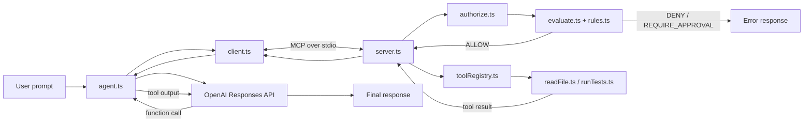

# Secure Dev MCP — learning project

A small TypeScript project for learning the basic boundaries of an MCP system: an agent, an MCP client, an MCP server, a policy layer, a tool registry, and two deliberately simple local tools.

> [!IMPORTANT]
> This is an educational project, not a production security boundary or a general-purpose development agent. The word **secure** describes the ideas being explored—default-deny policy, authorization before execution, workspace confinement, and tests—not a claim that the implementation is hardened.

The scope is intentionally frozen. The project exists to explain and test the current design, not to accumulate features.

## What it demonstrates

- exposing local capabilities as MCP tools;
- connecting an MCP client and server over standard input/output;
- translating MCP tool definitions into OpenAI function tools;
- keeping model orchestration separate from tool execution;
- authorizing every server-side tool call before dispatch;
- resolving overlapping rules with explicit precedence;
- adding capability-specific checks inside a file-reading tool; and
- testing the policy, authorization wrapper, tool implementation, and MCP boundary.

The server exposes only:

| Tool | Input | Current behavior |
| --- | --- | --- |
| `run_tests` | none | Runs the fixed command `npm test` in the server's startup working directory. |
| `read_file` | `{ "path": string }` | Reads a UTF-8 file after policy and file-confinement checks. |

## Architecture



The central server pipeline is:

```text
MCP request -> validate arguments -> authorize -> dispatch -> execute -> MCP result
```

### Responsibility boundaries

| Part | Responsibility | Explicitly does not do |
| --- | --- | --- |
| `src/agent.ts` | Gives the model the available tools, forwards requested calls through the MCP client, returns tool outputs to the model, and prints the final answer. | It does not import or execute local tool implementations and does not make policy decisions. |
| `src/client.ts` | Starts the server process, connects over stdio, lists tools, converts their schemas to OpenAI function definitions, calls tools, and closes the connection. | It does not decide when a tool should be used or whether a call is authorized. |
| `src/server.ts` | Registers MCP tools, constructs typed authorization requests, enforces authorization, and dispatches allowed calls. | It does not choose tools or generate an AI response. |
| `src/policy/*` | Represents requests and rules, evaluates matching rules, and turns non-allow decisions into errors. | It does not authenticate callers, validate registry membership, or execute tools. |
| `src/tools/toolRegistry.ts` | Maps stable tool names to local implementations. | It does not perform policy evaluation or model orchestration. |
| `src/tools/*` | Performs the actual local capability. `read_file` also applies capability-specific checks as a second layer. | It should not decide whether the model needs the capability. |

This separation is the main lesson of the project: the model may **request** a capability, but only the server may authorize and execute it.

## Request flow

1. `agent.ts` connects through `client.ts`.
2. `client.ts` starts `src/server.ts` with a stdio transport.
3. The client asks the server for its MCP tool definitions.
4. The agent presents those definitions to the OpenAI Responses API.
5. When the model emits a function call, the agent checks that the advertised tool name exists and sends the call through MCP.
6. The server creates a `ToolRequest` and calls `authorize`.
7. `evaluate` compares that request with the policy rules.
8. Only an `ALLOW` decision reaches the registry and local implementation.
9. The MCP result is returned to the model as a `function_call_output`.
10. The loop continues until the model returns no further function calls, then the final text is printed.

The prompt currently hardcoded in `agent.ts` is an adversarial learning scenario: it asks the model to run tests and then attempts to direct file inspection outside the workspace and toward environment files. It is intended to exercise server-side controls rather than to represent normal application input.

## Policy model

A request contains a tool, environment, operation, and—when required—arguments. A rule may constrain the tool, environment, operation, and resource, then returns one of:

- `ALLOW`
- `DENY`
- `REQUIRE_APPROVAL`

Evaluation follows these rules:

1. no matching rule means `DENY`;
2. any matching hard-deny rule wins immediately;
3. otherwise, only the matching rules with the highest specificity are considered; and
4. ties resolve in the order `DENY`, `REQUIRE_APPROVAL`, then `ALLOW`.

Specificity is the number of constrained fields on a rule. This makes a narrow rule override a broad one without relying on array order.

The current policy allows local file reads and local test execution, denies the exact `.env` resource, and includes production examples for approval and hard denial. The write/delete production examples are not reachable through the current `ToolRequest` union because no write or delete tool exists; they demonstrate policy vocabulary rather than an exposed capability.

`REQUIRE_APPROVAL` is also only a decision value in this project. There is no interactive approval workflow: `authorize` turns that decision into an error, so the operation does not run.

## File layout

```text
.
├── docs/                       # Original responsibility notes
├── src/
│   ├── agent.ts                # Optional model/tool orchestration demo
│   ├── client.ts               # MCP client and OpenAI tool adaptation
│   ├── server.ts               # MCP server and authorization boundary
│   ├── policy/
│   │   ├── authorize.ts        # Enforces the evaluator's decision
│   │   ├── confinement.ts      # Workspace root and blocked basenames
│   │   ├── evaluate.ts         # Matching and precedence algorithm
│   │   ├── rules.ts            # Declarative policy rules
│   │   └── types.ts            # Request, decision, and model-tool types
│   └── tools/
│       ├── readFile.ts          # UTF-8 file reader with local checks
│       ├── runTests.ts          # Fixed npm test command
│       └── toolRegistry.ts      # Name-to-implementation map
├── test/
│   ├── authorize.test.ts
│   ├── mcpIntegration.test.ts
│   ├── policy.test.ts
│   └── readFile.test.ts
├── package.json
├── package-lock.json
└── tsconfig.json
```

## Requirements and commands

The installed OpenAI SDK requires Node.js 22 or newer. The MCP v2 packages require Node.js 20 or newer, so **Node.js 22+** is the effective project requirement.

> [!NOTE]
> The current dependency metadata still has the reproducibility gap described in [Packaging note](#packaging-note). Correct that before treating these as clean-checkout instructions.

```bash
npm install
npm test
npm run typecheck
```

Start only the stdio server with:

```bash
npm run dev
```

A stdio MCP server normally appears idle when started by itself; it expects protocol messages from an MCP client, and stdout is reserved for those messages.

Run the optional agent demo with an API key in the environment:

```bash
OPENAI_API_KEY=your_key_here npm exec tsx -- src/agent.ts
```

PowerShell equivalent:

```powershell
$env:OPENAI_API_KEY = "your_key_here"
npm exec tsx -- src/agent.ts
```

Do not commit API keys or place them in source code.

## Tests

The test suite currently checks:

- allowed, denied, and approval authorization outcomes;
- policy decisions for representative requests;
- reading a file inside the workspace;
- blocking selected environment-file basenames;
- rejecting a basic `..` traversal attempt; and
- successful and denied `read_file` calls across a real MCP stdio connection.

Run it with `npm test`. Type-check source and tests with `npm run typecheck`.

Passing tests show that the covered examples behave as expected; they do not prove that the process is sandboxed or that all path forms are safe.

## Security boundaries and known limitations

The project deliberately keeps its threat model small:

- The server is a local child process using stdio. It has no remote transport, caller authentication, user isolation, or network authorization layer.
- Tools run with the same operating-system permissions as the Node.js process.
- `run_tests` executes project-controlled package scripts. Although its command is fixed, those scripts are code execution and should only be run in a trusted workspace.
- Workspace confinement currently compares resolved path strings with `startsWith`. That is not a safe directory-boundary test: a sibling path whose name begins with the workspace path can pass. A relative-path containment check is needed.
- Resolving a path lexically does not prevent an in-workspace symbolic link from pointing outside the workspace. Strong confinement must account for real paths and link behavior.
- The policy denies only the exact resource string `.env`, while the tool implementation blocks a separate hardcoded basename list. Inputs such as `./.env` therefore receive different answers from the two layers even though execution is currently blocked by the tool.
- A blocklist of environment filenames is not a general secret-detection mechanism. Other credentials, configuration files, and unlisted dotenv variants remain readable.
- `REQUIRE_APPROVAL` does not obtain human approval; it rejects the call.
- The agent trusts function-call arguments to be valid JSON and has no explicit maximum number of tool rounds.

These limitations are reasons to describe the repository as a learning model, not as a hardened sandbox.

## Packaging note

The source directly imports the MCP client, MCP server, OpenAI SDK, and Zod. The scripts and compiler configuration also depend on `tsx`, TypeScript, and the Node.js type declarations. For a clean checkout to be reproducible, every directly imported package and every command-line development tool must be declared in this project's own `package.json`; relying on transitive, global, or parent-directory installations can make local checks pass accidentally.

After dependency metadata is corrected, regenerate `package-lock.json` with npm rather than editing the lockfile manually, then verify from a clean install with `npm ci`, `npm test`, and `npm run typecheck`.

## Further reading

- [Model Context Protocol](https://modelcontextprotocol.io/)
- [MCP TypeScript SDK v2](https://ts.sdk.modelcontextprotocol.io/v2/)
- [MCP server tools guide](https://ts.sdk.modelcontextprotocol.io/v2/servers/tools)
- [MCP client guide](https://ts.sdk.modelcontextprotocol.io/v2/clients/connect)
- [OpenAI Responses API](https://platform.openai.com/docs/api-reference/responses)
- [Node.js test runner](https://nodejs.org/api/test.html)

The short notes in [`docs/`](docs/) record the original responsibility exercise that led to this architecture.
